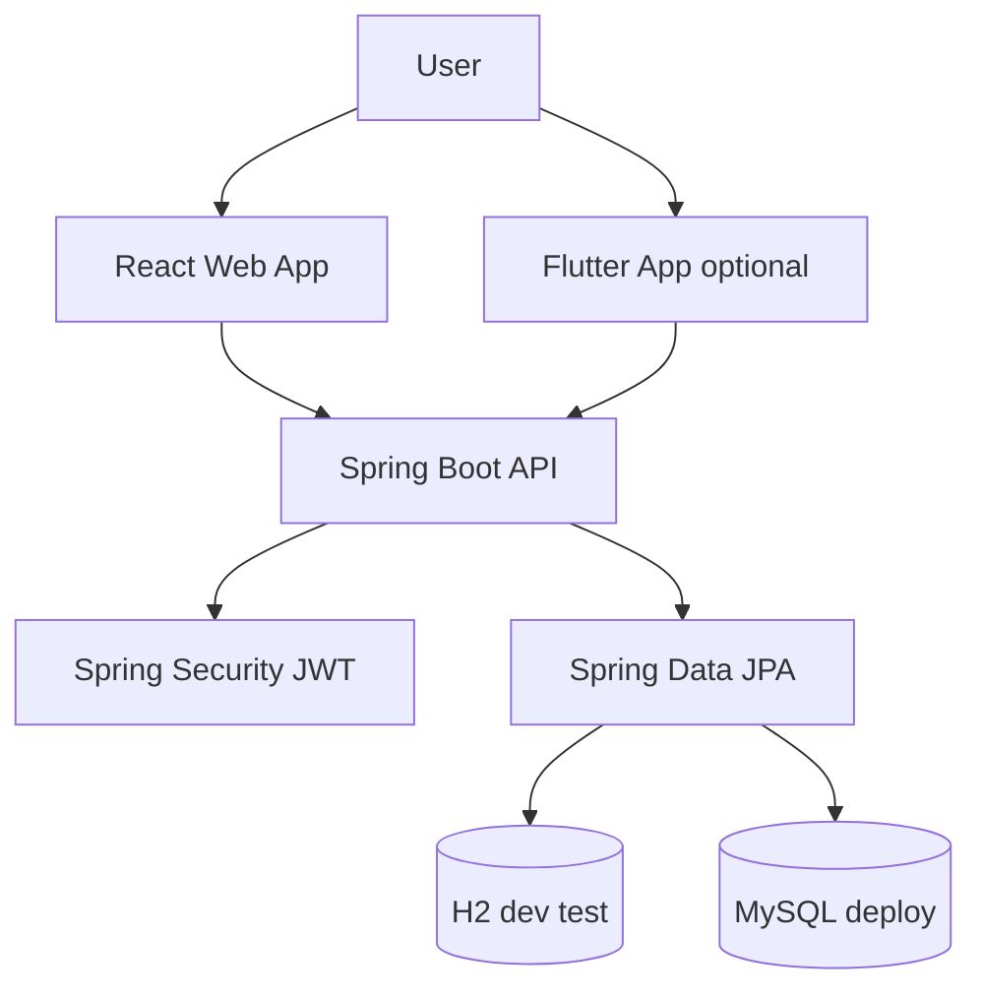

# Architecture

## Summary

COVA Task Manager is a **modular monolith**: one Spring Boot application owns authentication, task logic, and persistence. The React web app (and optional Flutter client later) talk to the same JSON API.

The domain is small; the design avoids microservices, message buses, or extra infrastructure until a real need appears.

## Current implementation (Phase 1)

- Spring Boot application starts with **H2** (default) or **MySQL** profile.
- Spring Security is configured with a minimal filter chain (health, H2 console in dev). **JWT and REST controllers are not built yet.**
- Frontend is a **COVA-themed shell** (Tailwind + shadcn/ui), not the finished product UI.

## Target structure (backend)

Dependency direction:

```text
presentation (controllers, request/response DTOs)
        ↓
application (services, use cases)
        ↓
domain (models, business rules)
        ↑
infrastructure (JPA, security, JWT)
```

Packages will follow this layout as features are added under `com.pauluno.task_manager`.

## System context



## Clients

| Client | Status |
| --- | --- |
| React + Vite + TypeScript | Shell in place; features pending |
| Flutter | Optional; not started |

## Not built yet

- User and Task entities, repositories, services
- Auth (register, login, JWT)
- Task CRUD, search, filtering, ownership checks
- Global API error handling
- Production deployment on GCP

These are intentional next phases after the repository foundation.
