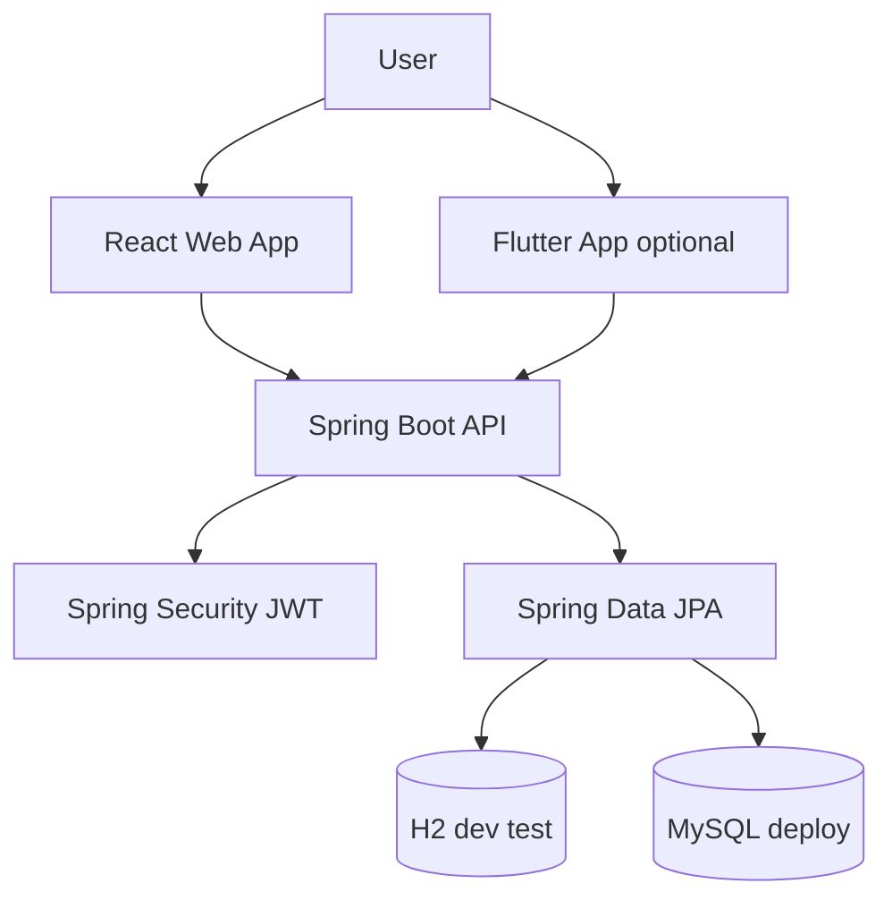

# Architecture

## Summary

COVA Task Manager is a **modular monolith**: one Spring Boot application owns authentication, task logic, and persistence. The React web app (and optional Flutter client later) talk to the same JSON API.

The domain is small; the design avoids microservices, message buses, or extra infrastructure until a real need appears.

## Current implementation (backend)

- Spring Boot application starts with **H2** (default/tests), **MySQL** (local Docker Compose),
  or a managed MySQL (Aiven, in production) profile — same code, only datasource config differs.
- Spring Security validates stateless JWT bearer tokens: a 15-minute access token and a 7-day
  refresh token, distinguished by a `type` claim so neither can be replayed as the other.
  Register, login, and refresh are public; `/api/auth/me` and `/api/tasks/**` require a token.
- JPA persistence owns `UserEntity` and `TaskEntity`; controllers use request/response DTOs
  rather than exposing entities.
- Task queries always scope by authenticated user id. Update and delete query by both task id
  and owner id — a request for another user's task returns `404`, never `403`, so existence
  isn't leaked.
- Frontend is a fully implemented React app: JWT auth (login/register/logout, silent refresh),
  a Kanban task board (drag-and-drop status changes, click-to-view detail, create/edit/delete,
  search + status filter), EN/FR i18n, and PWA installability — not just a themed shell.

## Package structure (backend)

Dependency direction:

```text
presentation (controllers, request/response DTOs)
        ↓
application (services, use cases)
        ↓
domain (models, business rules)
        ↑
infrastructure (JPA, security, JWT)
```

This is the actual current layout under `com.pauluno.task_manager` — not a future target.

## System context



## Clients

| Client | Status |
| --- | --- |
| React + Vite + TypeScript | Fully implemented — auth, Kanban dashboard, i18n, PWA |
| Flutter | Optional; not started |

## Not built yet

- Flutter mobile client (optional bonus scope; the checklist's own rule is not to start it
  before the deployed web version works — that condition is now satisfied)
- Cloud SQL/managed-MySQL wiring for a GCP deployment specifically (Render + Vercel + Aiven
  is what's actually deployed — see [`docs/deployment.md`](deployment.md))
