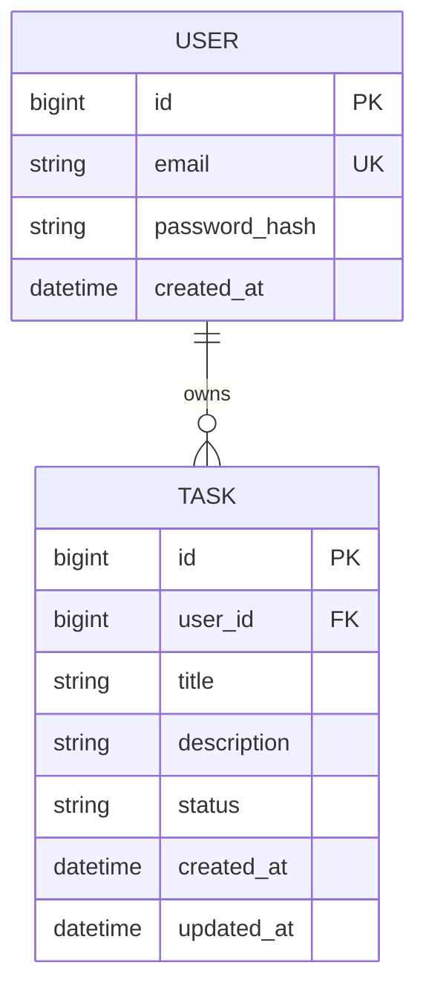

# Database (planned model)

**Status:** schema below is **planned**. JPA entities and migrations are not in Phase 1.

## Profiles

| Profile | Use |
| --- | --- |
| `h2` (default) | Local run and automated tests; in-memory H2 |
| `mysql` | Local MySQL via Docker Compose; production-like |

Only datasource configuration differs between profiles—not duplicate business logic.

## Entity relationship

## Constraints (planned)

- `USER.email` is unique.
- Each `TASK` belongs to exactly one `USER`.
- `TASK.status` is an enum: `TODO`, `IN_PROGRESS`, `DONE` (not free-form strings).
- `created_at` / `updated_at` maintained on tasks.

## Indexes (planned)

- Index on `task.user_id` for listing by owner.
- Optional composite index for `(user_id, status)` if filtering is hot.

## Security

Passwords stored as **BCrypt hashes** only. No plaintext passwords in the database, logs, or API.
