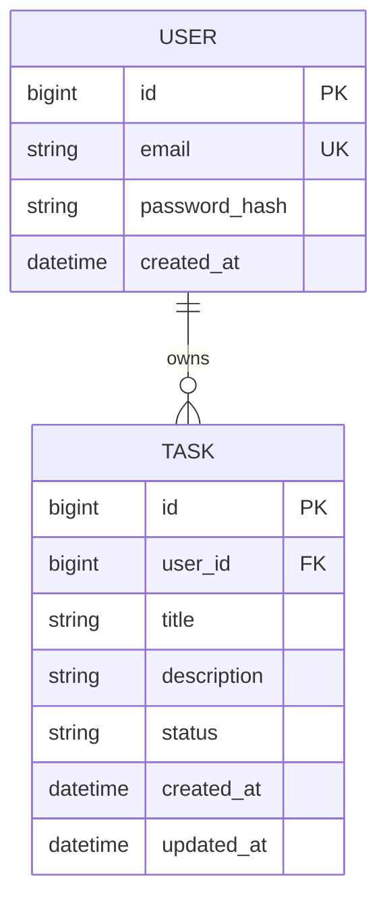

# Database

**Status:** User and Task JPA entities are implemented. Schema is generated by JPA for H2 and MySQL in the current assessment scope.

## Profiles

| Profile | Use |
| --- | --- |
| `h2` (default) | Local run and automated tests; in-memory H2, `ddl-auto: create-drop` |
| `mysql` | MySQL via Docker Compose locally, or a managed instance in production; `application-mysql.yaml`, `ddl-auto: update` |

Only datasource configuration differs between profiles (`application-mysql.yaml`)—not duplicate
business logic. Activate it with `SPRING_PROFILES_ACTIVE=mysql`; the same profile runs against
`docker compose up -d mysql` locally (verified end-to-end: register/login/tasks/refresh) and
against **Aiven** (managed MySQL, free tier) in the deployed environment — only
`DB_URL`/`DB_USERNAME`/`DB_PASSWORD` change, no code differences. See
[`docs/deployment.md`](deployment.md).

## Entity relationship

## Constraints

- `USER.email` is unique.
- Each `TASK` belongs to exactly one `USER`.
- `TASK.status` is an enum: `TODO`, `IN_PROGRESS`, `DONE` (not free-form strings).
- `created_at` / `updated_at` maintained on tasks.

## Indexes

- The `task.user_id` foreign key defines task ownership.
- Add a composite `(user_id, status)` index only if profiling shows filtering needs it.

## Security

Passwords stored as **BCrypt hashes** only. No plaintext passwords in the database, logs, or API.
